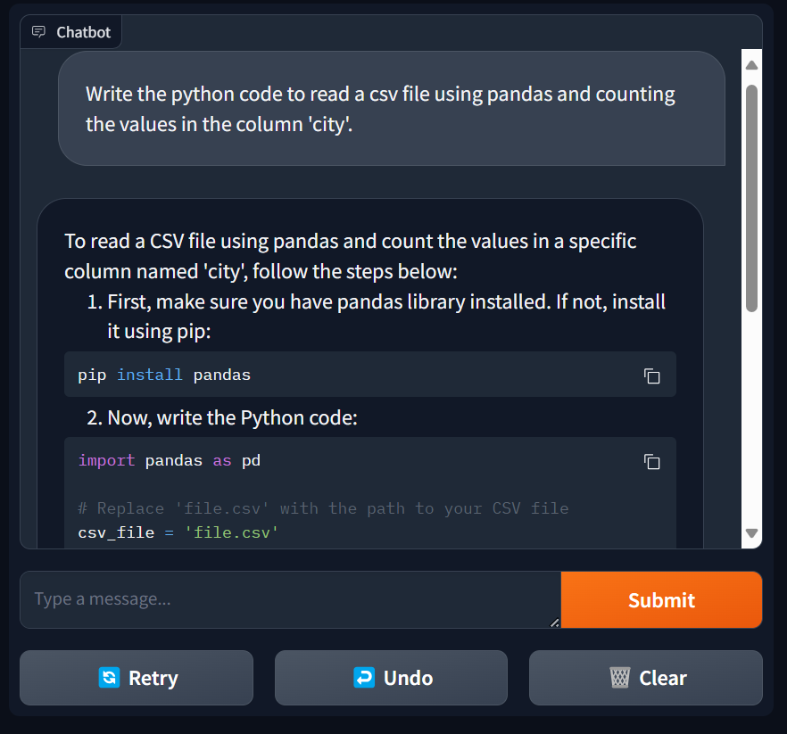
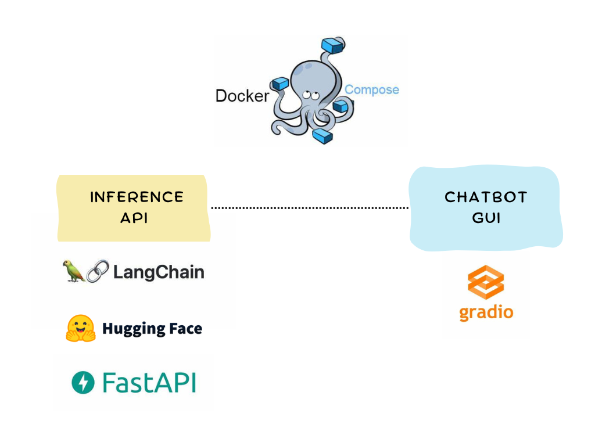

# Deploy a chatbot with Huggingface Inference API

This repository contains the code to deploy a Mistral-based chatbot using Docker Compose and Huggingface Inference API.



## Technological stack

As shown in the figure below the following frameworks have been used in this project:

- Langchain
- Huggingface API
- FastAPI
- Gradio




## How to use

1. Clone the repository.
```bash
git clone https://github.com/robertanto/local-chatbot-ui.git
cd local-chatbot-ui
```

2. Create a Huggingface API token as shown [here](https://huggingface.co/docs/hub/security-tokens) and insert it in the `docker-compose.yaml` file.

3. Run the containers
```bash
docker compose up -d
```

You can interact with the chatbot at [http://localhost:7860/](http://localhost:7860/).